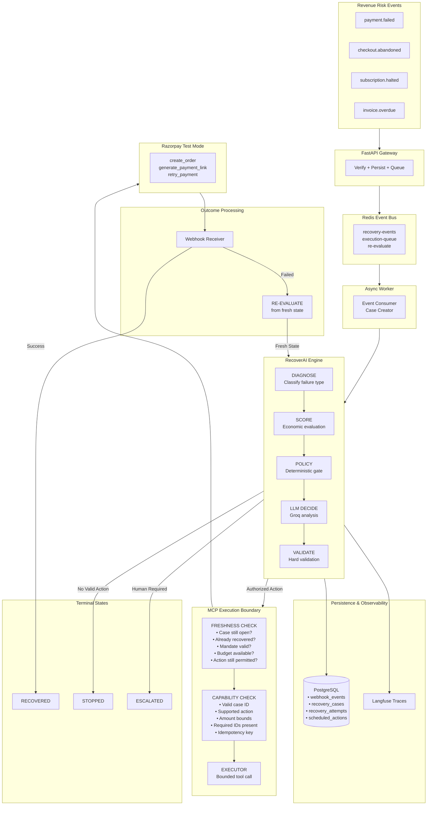
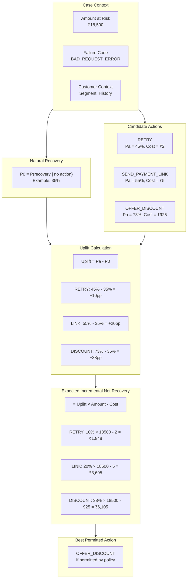
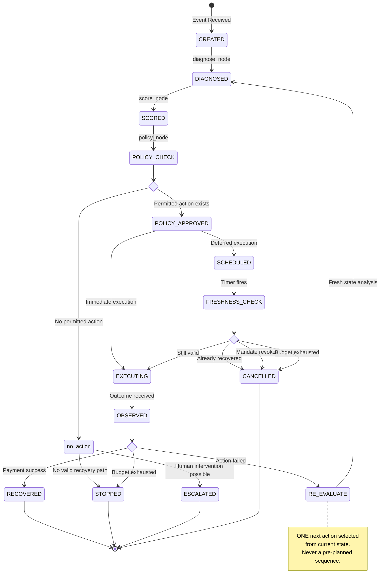
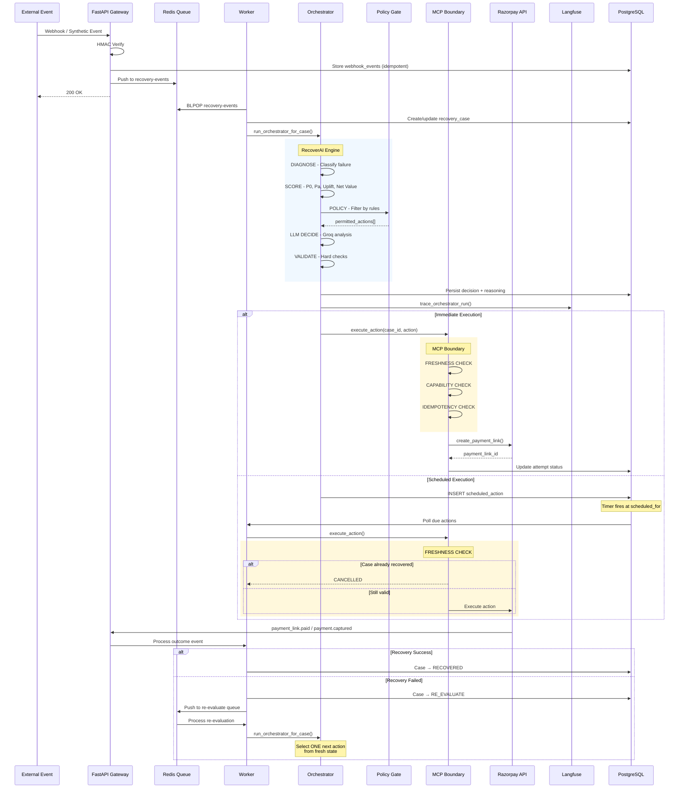

# RecoverAI - System Architecture

> **RecoverAI is an event-driven revenue recovery engine that continuously detects revenue at risk, estimates the incremental value of possible interventions, applies deterministic policy and freshness checks, executes one bounded action through an MCP-controlled Razorpay boundary, and re-evaluates from the resulting state until the revenue is recovered or recovery is safely stopped.**

---

## Core Architectural Principles

### One-Next-Action Decisioning
- Select exactly ONE permitted action based on current state
- After outcome, RE-EVALUATE before selecting another action
- **RecoverAI never commits to a pre-planned recovery sequence**
- Each subsequent action is selected from the latest observed state

### Separation of Concerns
- **LLM reasons** about what action might help
- **Economic engine measures** incremental value
- **Policy gate authorizes** deterministically
- **MCP boundary limits** capability
- **Freshness check re-validates** before execution

---

## High-Level Architecture



---

## Economic Decision Model

The core decision is **economic**, not just "LLM saw failure → send link".



---

## Recovery Case State Machine



---

## Execution-Time Freshness Check

Critical for preventing stale actions:

```
10:00 → RecoverAI schedules retry for 10:10
10:05 → Customer pays manually via different channel
10:10 → Scheduler wakes up
10:10 → FRESHNESS CHECK
        ├── Case still open? → NO (already RECOVERED)
        └── Action: CANCELLED

Result: No duplicate charge, no customer confusion
```

### Freshness Check Components

| Check | Purpose |
|-------|---------|
| Case still open? | Prevent action on resolved case |
| Customer already recovered? | Prevent duplicate recovery attempts |
| Mandate still valid? | Subscription/recurring only |
| Retry/contact budget available? | Respect limits |
| Action still permitted by policy? | Policy may have changed |

---

## Complete Data Flow



---

## Technology Stack

| Layer | Technology | Purpose |
|-------|------------|---------|
| Gateway | FastAPI | Webhook receiver, API routes |
| Queue | Redis | Event bus, worker coordination |
| Persistence | PostgreSQL | Cases, attempts, scheduled actions |
| Orchestrator | LangGraph | Single-graph decision engine |
| LLM | Groq (Llama 3.1 8B) | Failure analysis + reasoning |
| Execution | MCP Server | Bounded tool capability |
| Payments | Razorpay Test Mode | Real payment operations |
| Observability | Langfuse | Trace dashboard |
| Frontend | React + Tailwind | Merchant dashboard |
